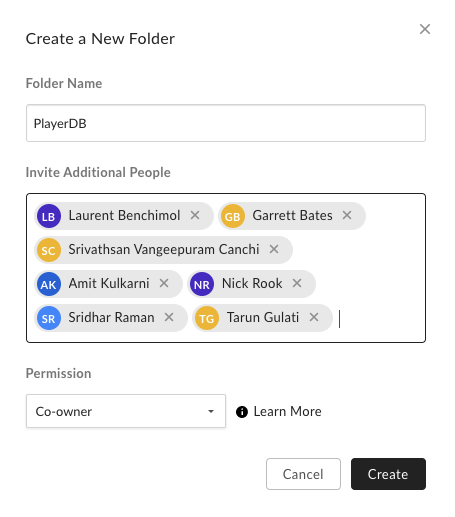
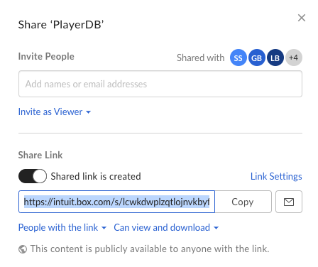

# How to reference external files?
If you are creating a question that requires sharing static content such as images, json or txt files, then apply the following steps 
to ensure these contents are shared in a secure and consistent fashion.

## Steps to create externally shareable folders

1. Create a new folder in [Intuit's Box](https://intuit.app.box.com/folder/0) and apply the following permission changes on the Folder:
    * Assign the Repo [SuperAdmins](https://github.intuit.com/orgs/poolhiring/teams/a4a-superadmin/members) as Co-owners. This allows co-owners to change the files, if needed, in future. 

2. Create a Shared Link and make it accessible to **all people** with the link to View and Download.   

3. Add your files to the folder. 

4. Use the directory shared link in your question.