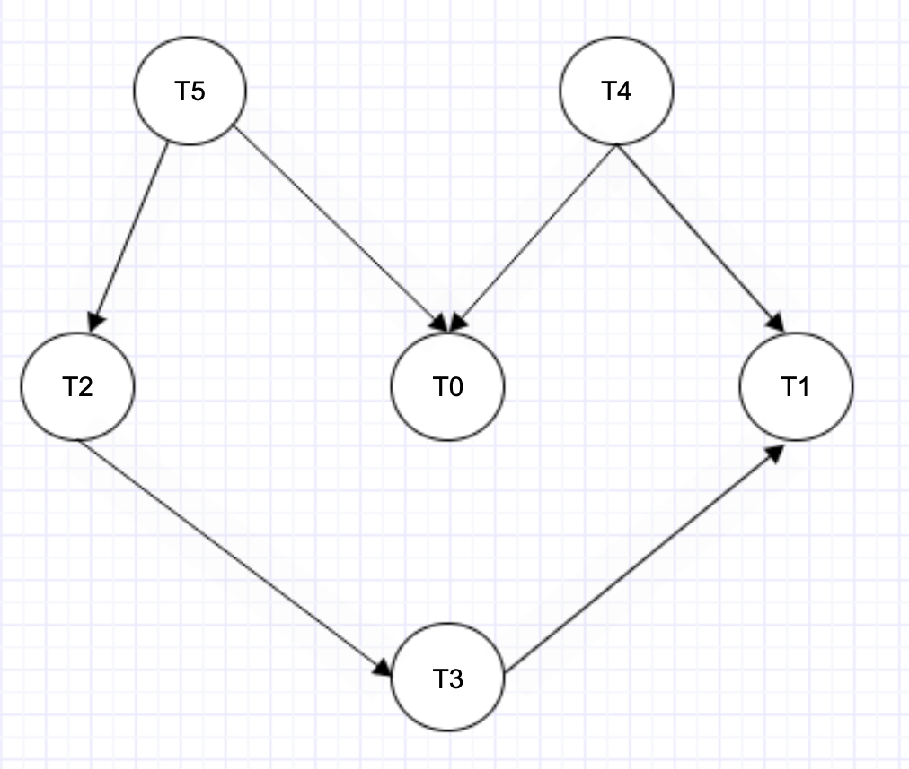

# Sort tasks which are dependent on other tasks

## Tags

Level Options: `senior`, `staff`, `principal`

Role Category: `backend`

Difficulty Options: `hard`

Interview Type Options: `phonescreen`, `onsite`

## Share with Candidate - Public
### Description
QBO has a feature called ***tasks*** where QBO users can create tasks to organize their work.
Task can have properties like description, due date, assignment and any other high level characteristics. QBO customers can create tasks and define dependency among them. For example, TaskC has a dependency with TaskA & TaskB. Each task can have some prerequisite tasks which need to be completed before it can be scheduled.

TaskC -> TaskA, TaskB

This means that TaskC needs to be completed before TaskA & TaskB

We need to design a scheduler for tasks which can perform the following actions and write a method to find the ordering of tasks we should pick to finish all tasks.

1. **createTask**
    * creates a new task
2. **addDependency**
    * creates a dependency between tasks
3. **scheduleTask**
    * sort tasks based on their order of dependency

#### Example
Consider 6 task objects T0, T1, T2, T3, T4, T5 and T6. Their dependency is defined as - 

* T5 has a dependency with T2 
* T5 has a dependency with T0 
* T4 has a dependency with T0 
* T4 has a dependency with T1
* T2 has a dependency with T3
* T3 has a dependency with T1

What is the ordering of the tasks based on the above defined dependencies?

### Preparation Instructions to be Shared in Advance

* You can use any programming language & IDE of your choice


## Intuit Internal ONLY Do Not Share with Candidate

### Estimated time to complete
* ~ 15-20 minutes to come up with a design
* ~25-30 minutes to code

### Common Clarification Questions/FAQ

* Is the TaskScheduler connected to a DB of tasks?
` Ideally, but for simplicity you can use an in-memory DB to keep a track of your tasks`
* Can there be a condition when there is a cyclic dependency between tasks? How should we handle it? **Good question. Discuss how this can be handled. One option is to check for cyclic dependency when we add dependencies between tasks **
`Yes, there can be a case of cyclic dependency. How would you handle it?` 

### Hints
* Topological sorting
* Task objects are nodes of a graph. The dependency between the tasks are edges and we get a directed graph.

For the example above:



The sorted order for the tasks based on the dependency is -

T5 -> T4 -> T2 -> T3 -> T1 -> T0

another sorted order is - 

T4 -> T5 -> T2 -> T3 -> T1 -> T0


### Follow up questions

* Is your solution thread safe? If not, what do you need to do to make it thread safe?
* When will it be not possible to schedule all tasks? `If there is a cylic dependency between tasks then it will not be possible to schedule tasks`


### Solution
* Traverse the graph by using DFS.
* We will traverse through all tasks and check if we have "visited" it. We will the recursively call DFS for its adjacent tasks and then push the task in a stack. We will finally pop contents of the stack which is the output. Note that a vertex is pushed to stack only when all of its adjacent vertices (and their adjacent vertices and so on) are already in the stack.

### Possible Solution (works as is in glider)
Solution for the example above
```java
import java.util.*;

class Main {
    
    public static void main(String[] args) {

        TaskScheduler taskScheduler = new TaskScheduler();

        /* Add tasks to scheduler */
        taskScheduler.createTask("t0 description", "2020-01-03", 0);
        taskScheduler.createTask("t1 description", "2020-02-03", 1);
        taskScheduler.createTask("t2 description", "2020-12-02", 2);
        taskScheduler.createTask("t3 description", "2020-11-03", 3);
        taskScheduler.createTask("t4 description", "2020-02-05", 4);
        taskScheduler.createTask("t5 description", "2020-03-13", 5);

        /*
        * 0 ->
        * 1 ->
        * 2 -> 3
        * 3 -> 1
        * 4 -> 0, 1
        * 5 -> 2, 0
        * */
        try {
            /* Add task dependency */
            taskScheduler.addDependency(5, 2);
            taskScheduler.addDependency(5, 0);
            taskScheduler.addDependency(4, 0);
            taskScheduler.addDependency(4, 1);
            taskScheduler.addDependency(2, 3);
            taskScheduler.addDependency(3, 1);

        } catch (Exception e) {
            System.out.println(e);
        }


        for(Task t : taskScheduler.scheduleTasks()) {
            System.out.println(t.toString());
        }

    }
    
    static class TaskScheduler {

    private Map<Integer, Task> taskMap;
    private Map<Integer, List<Integer>> taskDependencyMap;

    /* For simplicity set static value of tasks */
    public TaskScheduler() {
        this.taskDependencyMap = new HashMap<>();
        this.taskMap = new HashMap<>();
    }

    /* TaskB is dependent on taskA */
    void addDependency(int taskA, int taskB) throws Exception {

        if(!this.taskDependencyMap.containsKey(taskA)) {
            throw new Exception("Incorrect task dependency");

            /* Other potential exceptions *
             -> duplication of dependencies
             -> Invalid task ids
             */
        }
        this.taskDependencyMap.get(taskA).add(taskB);

    }


    /* Add task to dependency map */
    void createTask(String taskDescription, String dueDate, int uniqueTaskId) {

        Task t = new Task(taskDescription, dueDate, uniqueTaskId);
        this.taskMap.put(t.getTaskId(), t);
        this.taskDependencyMap.put(t.getTaskId(), new ArrayList<>());
    }


    List<Task> scheduleTasks() {

        List<Task> taskList = new ArrayList<>();
        Stack<Integer> stack = new Stack();

        HashSet<Integer> visitedTasks = new HashSet<>();

        /* Call the recursive helper
           function to store
           Topological Sort starting
           from all tasks one by one
        */
        for(Integer taskId : this.taskMap.keySet()) {
            if(!visitedTasks.contains(taskId)) {
                scheduleTaskUtil(taskId, visitedTasks, stack);
            }
        }

        // pop contents of stack
        while (!stack.empty()) {
            taskList.add(this.taskMap.get(stack.pop()));
        }

        return taskList;

    }

    private void scheduleTaskUtil(int taskId, HashSet<Integer> visitedTasks, Stack<Integer> stack) {

        /* Add taskId to visited */
        visitedTasks.add(taskId);
        Integer thisTask;

        /* Fetch all dependencies of taskId */
        Iterator<Integer> it = this.taskDependencyMap.get(taskId).iterator();

        while (it.hasNext()) {
            thisTask = it.next();
            if (!visitedTasks.contains(thisTask)) {
                scheduleTaskUtil(thisTask, visitedTasks , stack);
            }

        }

        // Push current taskId to stack
        stack.push(taskId);
        }
    }

    static class Task {
        private int uniqueTaskId;
        private String taskDescription;
        private String dueDate;
        private String notes;
        private String assignee;


        /* For simplicity adding uniqueTaskId in constructor */
        public Task(String taskDescription, String dueDate, int uniqueTaskId) {
            this.uniqueTaskId = uniqueTaskId;
            this.taskDescription = taskDescription;
            this.dueDate = dueDate;
        }


        public int getTaskId() {
            return uniqueTaskId;
        }


        @Override
        public String toString() {
            return "Task{" +
                    "uniqueTaskId=" + uniqueTaskId +
                    ", taskDescription='" + taskDescription + '\'' +
                    ", dueDate='" + dueDate + '\'' +
                    '}';
        }
    }
    
}

```
### Output
```
Task{uniqueTaskId=5, taskDescription='t5 description', dueDate='2020-03-13'}

Task{uniqueTaskId=4, taskDescription='t4 description', dueDate='2020-02-05'}

Task{uniqueTaskId=2, taskDescription='t2 description', dueDate='2020-12-02'}

Task{uniqueTaskId=3, taskDescription='t3 description', dueDate='2020-11-03'}

Task{uniqueTaskId=1, taskDescription='t1 description', dueDate='2020-02-03'}

Task{uniqueTaskId=0, taskDescription='t0 description', dueDate='2020-01-03'}
```

### Time Complexity
* Time Complexity: **O(V+E)**.`The above algorithm is simply DFS with an extra stack. So time complexity is the same as DFS.`
* Auxiliary space: **O(V)**. `The extra space is needed for the stack.`

### How to Assess Candidate / Expected Answer by Level
 
```
* A strong SSE should be able to design the high level characteristics for the Task object and identify that the solution would involve graphs.
* A strong SSE should be able to define the entities required for the TaskScheduler class and be able to code the `createTask` and `addDependency` methods.
* A strong Staff SWE should identify that the problem involves topological sorting algorithm and should have a design in mind to solve it.
* A strong Staff SWE candidate should be able to converge on the optimal solution for the scheduleTasks methods  with some handholding within 30 minutes.

Also, questions that we would like the candidate to ask are also useful.
Edge cases identified, etc.
```


### Variation/Similar problems

* Find if it is possible to schedule all the dependent tasks?
`if the stack doesn't contain all tasks, there is a cyclic dependency between tasks, therefore, we will not be able to schedule all tasks`

## References
* [What is Topological Sorting](https://www.educative.io/edpresso/what-is-topological-sort)
* [Wikipedia - Topological Sorting](https://en.wikipedia.org/wiki/Topological_sorting)
* [Intro to Topological Sorting](https://www.geeksforgeeks.org/topological-sorting/)
